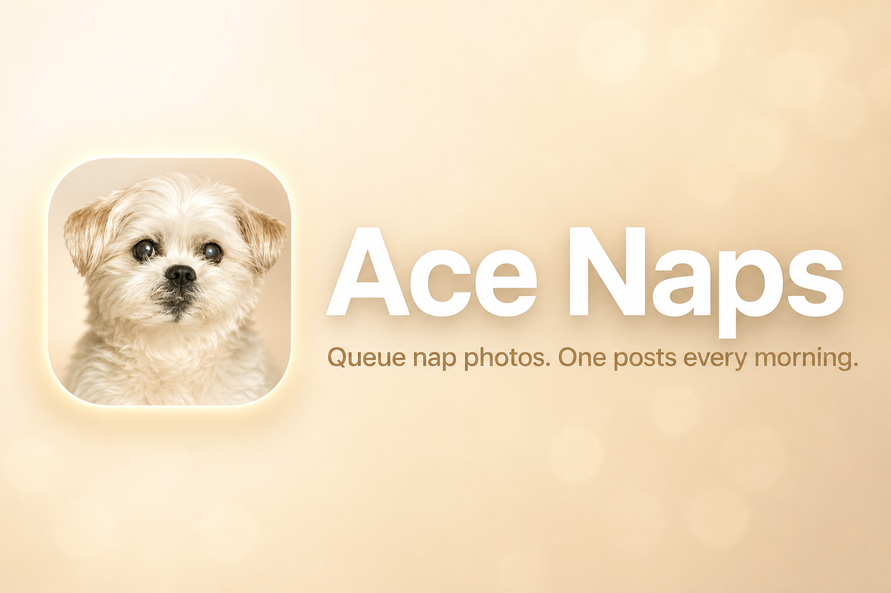

# ace-naps-posts



Upload nap photos of Ace. One photo posts to [@ace_naps](https://www.instagram.com/ace_naps/) every morning at 10:00 AM Eastern.

## How it works

Open the upload page on your phone, pick one or more photos, and send them. They go into a queue. Each day, the oldest photo is posted with an Ace-voice one-liner (OpenRouter vision) and the same hashtags every time.

## Edge Function secrets

Set these on `ace-naps-posts-instagram-function` in Supabase:

- `INSTAGRAM_ACCESS_TOKEN` — long-lived IGAA token
- `OPENROUTER_API_KEY` — for Ace vision captions at publish time
- `SUPABASE_URL` / `SUPABASE_SERVICE_ROLE_KEY` — usually provided by the platform

At publish time the signed photo URL is sent to OpenRouter so the model can write Ace’s caption. If OpenRouter fails, the queue row is marked `failed` (no static caption fallback).

## When Instagram stops posting

The access token expires about every 60 days. When that happens:

1. Open the [Ace Naps Posts Instagram API Setup](https://developers.facebook.com/apps/1510159334240003/use_cases/customize/API-Setup/?product_route=instagram-business&selected_tab=API-Setup&use_case_enum=INSTAGRAM_BUSINESS) page and generate a new long-lived token for `ace_naps`.
2. Sign in as `ace_naps` (not the Meta owner account). The token needs `instagram_business_content_publish` or publish fails with “Media ID is not available”.
3. Update the `INSTAGRAM_ACCESS_TOKEN` secret on the `ace-naps-posts-instagram-function` Edge Function in Supabase.

Automatic refresh isn’t built yet — you’ll need to do this by hand for now.

## If a post fails

Look at the row in Supabase, fix whatever went wrong, then run:

```sql
UPDATE posts_queue
SET status = 'pending', error_message = NULL
WHERE id = 'paste-id-here';
```

It’ll go out on the next morning run.

## More detail

See [AGENTS.md](AGENTS.md) and [docs/architecture/](docs/architecture/) if you’re working on the code.
