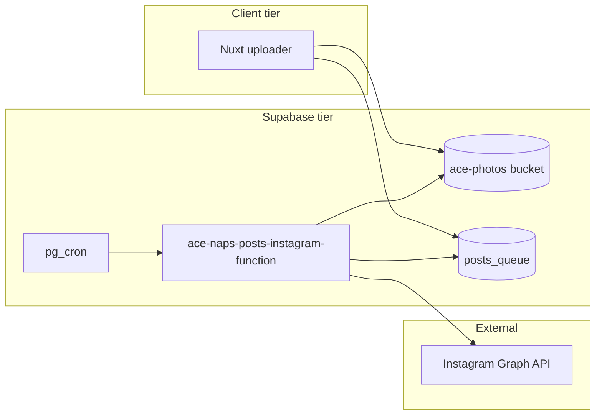
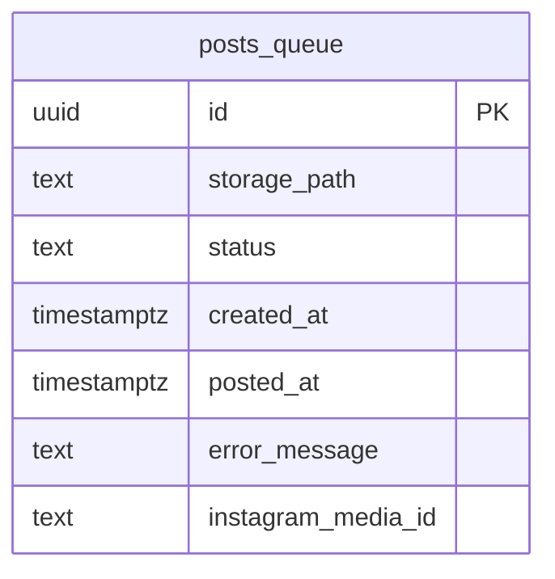

# Architecture Spine — ace-naps-posts

## Design Paradigm

**Split client / scheduled backend.** A thin Nuxt upload surface mutates Storage + queue rows. All Instagram credentials, publish orchestration, and cron invocation live in Supabase (Postgres + Edge Function). The frontend never calls Instagram.



## Invariants & Rules

### AD-1 — Upload surface is a single unauthenticated Nuxt page [ADOPTED]

- **Binds:** upload
- **Prevents:** scope creep into auth, dashboards, or multi-page admin flows in v1
- **Rule:** One route (`/`) with multi-file upload, submit, success/error feedback, and a read-only pending lineup (order, image, date). No login.

### AD-2 — One bucket, one queue table [ADOPTED]

- **Binds:** upload, queue, publish
- **Prevents:** dual-bucket moves, divergent status sources, ambiguous "next post" selection
- **Rule:** Bucket `ace-photos` with paths `inbox/<timestamp>-<random>-<filename>`. Table `posts_queue` is the sole posting state. Status enum: `pending` | `posted` | `failed`. Do not move objects between buckets in v1.

### AD-3 — Queue consumption is FIFO by created_at [ADOPTED]

- **Binds:** queue, publish
- **Prevents:** newest-first or random selection breaking user expectations
- **Rule:** Daily job selects one row: `status = 'pending'` ORDER BY `created_at ASC` LIMIT 1.

### AD-4 — Upload creates queue row only after Storage success [ADOPTED]

- **Binds:** upload, queue
- **Prevents:** orphan queue rows pointing at missing objects
- **Rule:** Storage upload → on success insert one `posts_queue` row with `status = 'pending'` and `storage_path`. On upload failure, show error; no insert.

### AD-5 — Secrets boundary [ADOPTED]

- **Binds:** upload, publish
- **Prevents:** leaked Instagram or service-role credentials in client bundles
- **Rule:** Frontend env: `NUXT_PUBLIC_SUPABASE_URL`, `NUXT_PUBLIC_SUPABASE_ANON_KEY` only. Edge Function secrets: `INSTAGRAM_ACCESS_TOKEN`, `OPENROUTER_API_KEY`, `SUPABASE_URL`, `SUPABASE_SERVICE_ROLE_KEY`.

### AD-6 — Daily publish via Supabase cron → Edge Function [ADOPTED]

- **Binds:** publish
- **Prevents:** external schedulers or client-triggered posting paths
- **Rule:** `pg_cron` + `pg_net` invoke `ace-naps-posts-instagram-function` once daily at 09:00 `America/New_York`. Empty queue logs `nothing to post` and exits 0.

### AD-7 — Caption composition [ADOPTED]

- **Binds:** publish
- **Prevents:** DB-backed caption CRUD, variable hashtag sets, or storing captions for review
- **Rule:** At publish time, Edge Function calls OpenRouter chat completions via plain `fetch` with hardcoded model `openai/gpt-4o-mini` and the signed image URL. Ace writes one humorous first-person sentence (16-year-old Shih Tzu, old boy, very good boy; no emojis; no hashtags from the model). Code appends `"\n\n" + FIXED_HASHTAGS` where `FIXED_HASHTAGS = '#naptime #sleep #dogsofinstagram #shihtzulover'`. Always generate; do not store the caption. OpenRouter failure → `status = 'failed'` (AD-9); no static fallback.

### AD-8 — Instagram publish flow [ADOPTED]

- **Binds:** publish
- **Prevents:** unsupported media types and multi-step client publishing
- **Rule:** Single-image feed post only. Sequence: create media container (image URL + caption) → publish container → persist `instagram_media_id`, `posted_at`, `status = 'posted'`. Account: `ace_naps` via Instagram Login API (`graph.instagram.com`, `/me` endpoints, IGAA token).

### AD-9 — Failure without auto-retry [ADOPTED]

- **Binds:** queue, publish
- **Prevents:** retry storms and scheduler complexity
- **Rule:** On publish failure set `status = 'failed'`, `error_message`. No automatic retry. Manual re-queue/defer is out-of-band (SQL or future admin).

### AD-10 — Private bucket with signed URLs at publish time [ADOPTED]

- **Binds:** publish
- **Prevents:** permanently public photo URLs while still satisfying Instagram fetch requirements
- **Rule:** Bucket `ace-photos` is private. Edge Function generates a short-lived signed URL before calling Instagram Graph API.

### AD-11 — RLS disabled until end-to-end flow works [ADOPTED]

- **Binds:** upload, queue
- **Prevents:** premature policy work blocking initial integration
- **Rule:** Leave RLS disabled on `posts_queue` (and use open Storage policies) while building and validating the pipeline. Add RLS hardening after the project is working.

### AD-12 — Frontend hosted on Netlify [ADOPTED]

- **Binds:** upload
- **Prevents:** ambiguous deployment target across environments
- **Rule:** Deploy the Nuxt app at repo root to Netlify. Configure `NUXT_PUBLIC_SUPABASE_URL` and `NUXT_PUBLIC_SUPABASE_ANON_KEY` in Netlify env vars.

## Consistency Conventions

| Concern | Convention |
|---|---|
| Naming | Bucket `ace-photos`; table `posts_queue`; function `ace-naps-posts-instagram-function`; status literals lowercase |
| Data & formats | UUID primary keys; timestamptz for `created_at` / `posted_at`; storage paths relative to bucket root |
| State & cross-cutting | Queue mutation for publish outcomes only in Edge Function; upload page inserts `pending` only |
| Logging | Empty queue: `nothing to post`; failures include API error text in `error_message` |

## Stack

| Name | Version |
|---|---|
| Nuxt | 4.4.8 |
| Nuxt UI | 4.x (match Nuxt major) |
| @supabase/supabase-js | latest stable at install |
| Supabase Edge Functions (Deno) | platform default |
| pg_cron + pg_net | Supabase hosted extensions |
| Instagram Graph API | Content Publishing (professional account) |
| Netlify | frontend hosting |

## Structural Seed

```text
ace-naps-posts/                 # repo root — Nuxt app lives here
  app.vue
  pages/index.vue
  composables/useSupabaseUpload.ts
  utils/supabase.ts
  supabase/
    functions/ace-naps-posts-instagram-function/index.ts
    migrations/001_create_posts_queue.sql
  docs/architecture/
  AGENTS.md
  README.md
```



## Capability → Architecture Map

| Capability / Area | Lives in | Governed by |
|---|---|---|
| Multi-file upload | `pages/index.vue` | AD-1, AD-4, AD-11, AD-12 |
| Object storage | Supabase Storage `ace-photos` | AD-2, AD-10 |
| Queue tracking | Postgres `posts_queue` | AD-2, AD-3, AD-4, AD-11 |
| Daily scheduling | `pg_cron` migration/SQL | AD-6 |
| Instagram publish | `supabase/functions/ace-naps-posts-instagram-function` | AD-5, AD-7, AD-8, AD-9, AD-10 |
| Caption generation | Edge Function → OpenRouter vision (`openai/gpt-4o-mini`) | AD-5, AD-7, AD-9 |
| Frontend deploy | Netlify | AD-12 |

## Deferred

| Item | Reason |
|---|---|
| User authentication / admin UI | Not required for personal uploader v1 |
| Caption DB / ops review of captions | Captions are ephemeral at publish time (AD-7) |
| Second storage bucket / file moves | DB status is enough |
| Auto-retry / backoff | Manual inspection first; retry via SQL (see README) |
| Carousels, reels, stories | Single-image feed only in v1 |
| Analytics | Non-goal |
| Optional recent-queue UI on upload page | Deferred to v1.1 |
| Instagram token refresh automation | Manual refresh for v1 (see README) |
| RLS and Storage policy hardening | After end-to-end flow is working |
